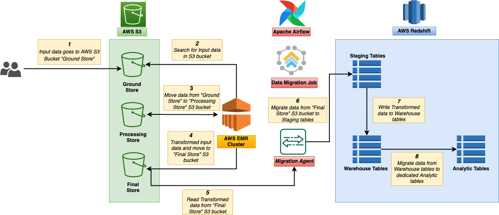
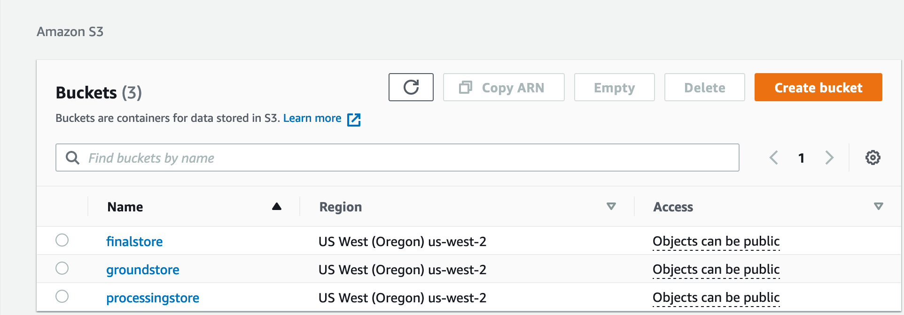
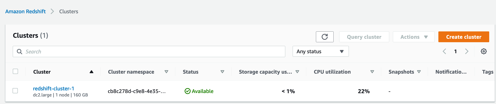
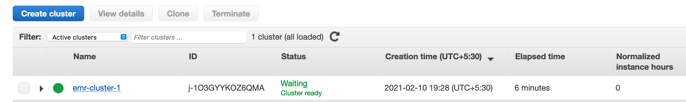
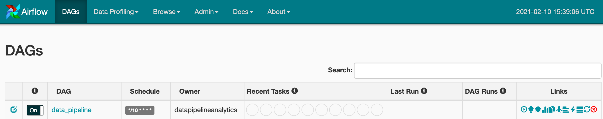
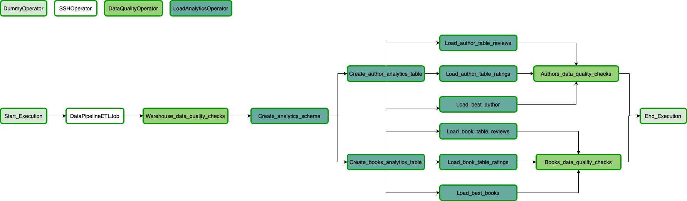

# Data Pipeline Analytics Platform

## Platform Architecture

### Data Pipeline  Components

Below are high level components of the project:

<b>1. AWS S3</b>

Input data files will be stored in S3 buckets.

Three S3 buckets will be used in the project:
- <i>Ground Store</i>: This bucket stores the input data files.
- <i>Processing Store</i>: Input data from Ground Store bucket is moved to Processing Store bucket. 
- <i>Final Store</i>: This bucket stores final version of processed input data from Processing Store bucket, ready to be taken to Redshift Staging schema tables for further processing.

<b>2. AWS EMR Cluster</b>

Involves running ETL Spark jobs to process and transform input data, move data to various schemas in warehouse to enable analytical processing of data.

<b>3. AWS Redshift</b>

Contains the schemas - Staging, Warehouse, Analytics to store, process and transform the input data to be ready for end-user processing.

<b>4. Apache Airflow</b>

This automates the ETL jobs written in Spark. ETL jobs exeuction can be scheduled as per requirement.

### Platform Architecture

- Data is provided as input in the form of CSV files obtained from [Kaggle](https://www.kaggle.com/san089/goodreads-dataset). 
- Input data is stored on local disk and then moved to the Ground Store Bucket on AWS S3. 
- ETL jobs are written in Spark and scheduled in Airflow to run every 10 minutes to perform operations and data quality checks on the input data, and move transformed data to Redshift schemas.

Below diagram depicts the platform architecture.

### Data Pipeline Flow

Below are steps undertaken during the Data Pipeline flow:

1. Input data files are placed in Ground Store S3 bucket.
2. S3 module of ETL Spark job copies data from Ground Store bucket to Processing Store bucket.
3. Once the data is moved to Processing Store bucket, Spark job is triggered which performs the below:
    - Reads the data from Processing Store bucket and applies transformations to the same.
    - Copies transformed input data from Processing Store bucket to Final Store bucket.
    - Create Redshift Staging and Warehouse schemas and their tables respectively.
5. Warehouse module of ETL Spark job picks up data from Final Store bucket and stages it into the Redshift staging schema tables.
6. Using the Redshift staging schema tables, UPSERT operation is performed on the data, and moves the same to the Redshift Warehouse schema tables.
7. ETL job execution is successfully completed once the Redshift Warehouse schema tables are populated.
8. Airflow DAG performs the below operations next:
    - Run data quality check on all Redshift Warehouse schema tables once the ETL job execution is completed.
    - Creates Redshift Analytic schema and its corresponding tables.
    - Configure Analytics queries in a Custom Designed Operator. These queries are run and again a Data Quality Check is done on selected Redshift Analytics schema tables.
10. Airflow DAG execution completes after these Data Quality checks on Redshift Analytic schema tables.

## Host Environment Setup

### AWS S3

Create three buckets using AWS UI. Ensure bucket has Public access.
1. Ground Store
2. Processing Store
3. Final Store

Below diagram depicts S3 buckets created in AWS.

### AWS Redshift

Create a Redshift cluster using AWS UI. Ensure to select below details during cluster creation.
1. Choose Free Trial.
2. Enter Database Name and Master User Name or choose default values.
3. Enter Master User Password.
4. Under Cluster Permissions -> Select IAM Role from the list -> Click "Add IAM Role". 
5. Click "Create Cluster".

Below diagram depicts Redshift cluster created in AWS.

### AWS EMR Cluster

Create a EMR cluster using AWS UI. Ensure to select below details during cluster creation.
1. Enter Cluster name or choose default value.
2. Choose Release "emr-5.20.0". 
3. Select Applications "Spark: Spark 2.4.0 on Hadoop 2.8.5 YARN with Ganglia 3.7.2 and Zeppelin 0.8.0".
4. Choose Instance Type "m3.xlarge".
5. Enter Number of Instances "2".
6. Select EC2 key pair with already created key-pair.
7. Click "Create Cluster".

Below diagram depicts EMR cluster created in AWS.

### Apache Airflow

Confifure Apache Airflow instance either on local setup or on AWS EC2 instance.

Followed GIT [repo](https://github.com/andresionek91/airflow-autoscaling-ecs) to setup Airflow.

Create below connections from Airflow UI console:
1. SSH connection to submit ETL Spark jobs.
  - Open Admin -> Connections -> Create
  - Enter below information in the various input fields:
    - Conn Id: emr_ssh_connection
    - Conn Type: SSH
    - Host: EMR_Master_Node_IP
    - Username: hadoop
    - Password: <Password>
    - Port: 22
    - Extra: {
                "key_file":"<EMR key pair file path>",
                "timeout":"10",
                "compress";"false",
                "no_host_key_check":"true",
                "allow_host_key_change":"false"
             }
  - Click Save.
2. Redshift connection to access Redshift cluster to create various schemas.
    - Open Admin -> Connections -> Create.
    - Enter below information in the various input fields:
      - Conn Id: redshift
      - Conn Type: Postgres
      - Host: <Redshift_Cluster_Endpoint>
      - Schema: <Redshift_Schema_Name>
      - Login: <Login_name>
      - Password: <Login_password>
      - Port:5439

## Data Dictionary

Data model consists of 3 schemas in Redshift warehouse. Following provides more information on the 3 schemas.

<b>1. Staging Schema</b>
   - Input data files from Ground Store bucket are stored in Staging schema tables.
   - [Data dictionary](https://github.com/sagardua297/udacity-data-engineering-nd/blob/main/Capstone%20Project/data_dictionary/staging_schema.xlsx)

<b>2. Warehouse Schema</b>
   - Data from Staging schema is moved to Processing Store bucket from Ground Store bucket. It is then transformed, re-partitioned and stored in Warehouse schema tables.
   - [Data Dictionary](https://github.com/sagardua297/udacity-data-engineering-nd/blob/main/Capstone%20Project/data_dictionary/warehouse_schema.xlsx)

<b>3. Analytics Schema</b>
   - Data from Final Store bucket is processed and stored in analytic tables in Analytics schema.
   - [Data Dictionary](https://github.com/sagardua297/udacity-data-engineering-nd/blob/main/Capstone%20Project/data_dictionary/analytics_schema.xlsx)

## Data Pipeline Execution

Ensure Airflow Webserver and Scheduler are running. Airflow UI can be accessed using http://<ip-address>:<configured-port>.

Below diagrams depicts Data Pipeline Airflow DAG.

## Scenarios

1. If the database size was increased by 100X:
    - Redshift cluster is already optimized for read heavy workloads. Volume of data will not be a problem here.
    - Need to increase EMR cluster size with higher volumes.

2. To update the database every morning at 7am:
    - Schedule for DAG execution can be modified to run every morning at 7am.

3. If the database needed to be accessed by 100+ people:
    - Redshift cluster concurrecy limits can be scaled based on requirement.
